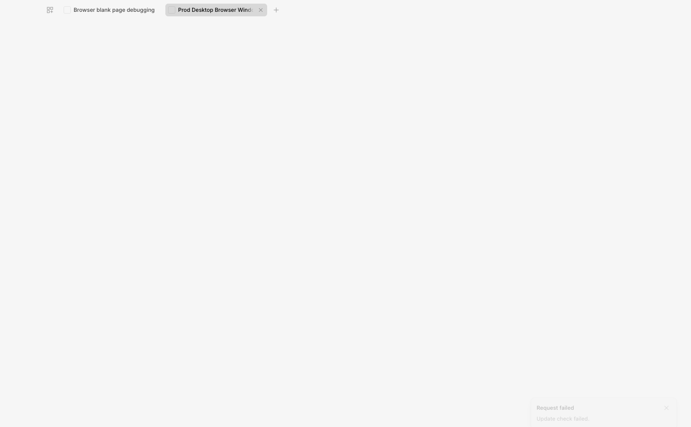

# Updater notice toast: invisible-toast race (fixed)

The `UpdaterNotice` component (mounted in both layouts) surfaces automatic
update-check failures as an in-app toast. While verifying it in the packaged
app, the toast never rendered even though `showToast` was called with the
correct classified message. This documents the root cause and the fix.

## Symptom

- `[updater-notice]` effect fires with `state=error` and calls `showToast`.
- `showToast` dispatches to the v2 (solid-sonner) store correctly (`v2=true`).
- No toast ever appears in the DOM — no `[data-sonner-toast]` element.

## Root cause: a mount-time subscription race

1. `UpdaterNotice` is mounted in the layout **before** `<ToastRegion v2 />`
   (it sits next to `UpdateAvailableToast`).
2. Its `createEffect` runs during the initial mount effect flush, and for a
   startup failure the error state is already present (delivered synchronously
   by the preload subscription), so the effect fires **on first run**.
3. solid-sonner's `Toaster` subscribes to its store in `onMount` — which is
   just a `createEffect` — created later in the same flush.
4. The toast is added to the store and published to **zero subscribers**, then
   the Toaster's `onMount` subscription snapshot has already been taken.
   Result: the toast exists in the store but is never rendered.

Manual "Check for updates" toasts never hit this because they fire from user
clicks long after mount. `UpdateAvailableToast` never hit it because it only
fires after async state arrives.

## Fix

Defer the `showToast` call past the mount flush with `queueMicrotask`, so the
toaster's subscription is guaranteed to be wired up before the toast is
published:

```ts
queueMicrotask(() => {
  showToast({ title: language.t("common.requestFailed"), description })
})
```

Pinned by a source-level regression test in `updater-notice.test.ts` that
asserts the `queueMicrotask(() => { showToast` pattern.

## Verification

In the packaged app with the update channel pointed at a non-existent owner:

- Main log: `Checking for update` → `HttpError: 404` → state `error`.
- DOM during the 5s toast window: `[data-sonner-toast]` present with
  title `Request failed` and description `Update check failed.`
  (the classified `unreachable` message).



## Related finding

The packaged app's auto-updater 404s on **every** launch: the GitHub repo
`klaut-pro/klautcode` is **private**, and the updater runs without a token, so
`releases.atom` returns 404 to it. Auto-update has effectively never worked
from the packaged app. The notice now surfaces this per session; making
auto-update actually work requires a public repo or a token-backed feed.
